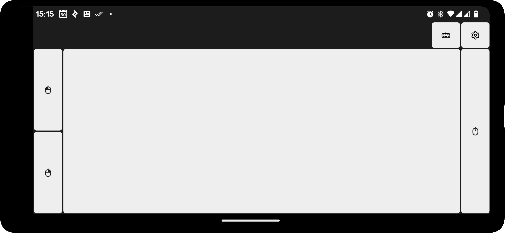

# µKbd

µKbd is an Android application that transforms your phone into a Bluetooth keyboard and touchpad combo.

## Usage

To use µKbd, launch the app and pair your device from within the app. After pairing, select your device from the devices list in the settings.

## Screenshots

## Contributing

Contributions are welcome.

## Acknowledgements

- [ComposePrefs3](https://github.com/JamalMulla/ComposePrefs3) - Library for managing preferences in Jetpack Compose
- [Flaticon Uicons](https://www.flaticon.com/uicons) - This is where most of the key symbols are from

## License

µKbd is available under the [BSD (3-Clause) License](https://opensource.org/licenses/BSD-3-Clause).
